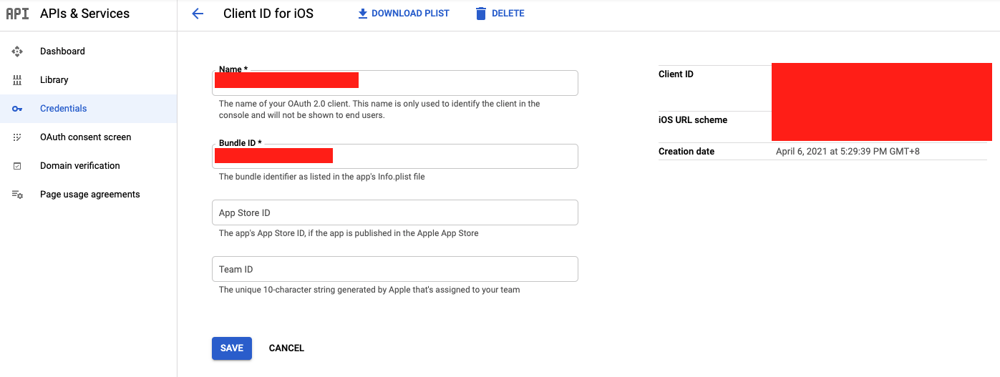

# AuthLogin

This project aims at providing all social logins( like FaceBook, Google, Firebase and Apple) under single package.
# Login With FaceBook
## Setup FaceBook Developers Account 

### Register Account
#### Step 1: Start the registration process
While logged into your Facebook account, go to [https://developers.facebook.com/async/registration](https://developers.facebook.com/async/registration).

Alternatively, you can go to the [Meta for Developers](https://developers.facebook.com/micro_site/url/?click_from_context_menu=true&country=IN&destination=https%3A%2F%2Fdevelopers.facebook.com%2F&event_type=click&last_nav_impression_id=07Hwa00MwndMYD11B&max_percent_page_viewed=85&max_viewport_height_px=639&max_viewport_width_px=1233&orig_http_referrer=https%3A%2F%2Fdevelopers.facebook.com%2Fdocs%2Fdevelopment%2Fregister%2F&orig_request_uri=https%3A%2F%2Fdevelopers.facebook.com%2Fx%2Fajax%2Ffeedback%2F&region=apac&scrolled=true&session_id=116HQtHYwPIwXSjgx&site=developers) website and click Get Started.

#### Step 2: Agree to our Terms and Policies
Click **Next** to agree to our [Platform Terms](https://developers.facebook.com/micro_site/url/?click_from_context_menu=true&country=IN&destination=https%3A%2F%2Fdevelopers.facebook.com%2Fterms&event_type=click&last_nav_impression_id=0IIsvdnfRXv1fikuU&max_percent_page_viewed=65&max_viewport_height_px=639&max_viewport_width_px=1233&orig_http_referrer=https%3A%2F%2Fdevelopers.facebook.com%2Fdocs%2Fdevelopment%2Fregister%2F&orig_request_uri=https%3A%2F%2Fdevelopers.facebook.com%2Fajax%2Fpagelet%2Fgeneric.php%2FDeveloperNotificationsPayloadPagelet%3Ffb_dtsg_ag%3D--sanitized--%26data%3D%257B%2522businessUserID%2522%253Anull%252C%2522cursor%2522%253Anull%252C%2522length%2522%253A15%252C%2522clientRequestID%2522%253A%2522js_1cm%2522%257D%26__usid%3D6-Trfxbid5gcyy2%253APrfxbia1xw9f33%253A0-Arfxazq17g1d9z-RV%253D6%253AF%253D%26jazoest%3D24838&region=apac&scrolled=true&session_id=116HQtHYwPIwXSjgx&site=developers) and [Developer Policies](https://developers.facebook.com/micro_site/url/?click_from_context_menu=true&country=IN&destination=https%3A%2F%2Fdevelopers.facebook.com%2Fdevpolicy&event_type=click&last_nav_impression_id=0IIsvdnfRXv1fikuU&max_percent_page_viewed=65&max_viewport_height_px=639&max_viewport_width_px=1233&orig_http_referrer=https%3A%2F%2Fdevelopers.facebook.com%2Fdocs%2Fdevelopment%2Fregister%2F&orig_request_uri=https%3A%2F%2Fdevelopers.facebook.com%2Fajax%2Fpagelet%2Fgeneric.php%2FDeveloperNotificationsPayloadPagelet%3Ffb_dtsg_ag%3D--sanitized--%26data%3D%257B%2522businessUserID%2522%253Anull%252C%2522cursor%2522%253Anull%252C%2522length%2522%253A15%252C%2522clientRequestID%2522%253A%2522js_1cm%2522%257D%26__usid%3D6-Trfxbid5gcyy2%253APrfxbia1xw9f33%253A0-Arfxazq17g1d9z-RV%253D6%253AF%253D%26jazoest%3D24838&region=apac&scrolled=true&session_id=116HQtHYwPIwXSjgx&site=developers).


#### Step 3: Verify your account
A confirmation code will be sent to the phone number and email address that was provided in order to confirm that the user have access to them. The number and email will be used for important developer notifications of any changes that may impact to the app.


#### Step 4: Select occupation
Select an occupation that most closely describes what you do for a living.

Now use the app Dashborad to create new app.


### Create App

#### Step 1: Start the app creation process
If you just came from the registration flow, click the Create First App button.
Otherwise, go to the Apps panel and click Create App.

#### Step 2: Choose an app type
App type determines which products and APIs are available to your app. If you are more familiar with facebook products and APIs, refer to our [app types](https://developers.facebook.com/micro_site/url/?click_from_context_menu=true&country=IN&destination=https%3A%2F%2Fdevelopers.facebook.com%2Fdocs%2Fdevelopment%2Fcreate-an-app%2Fapp-dashboard%2Fapp-types&event_type=click&last_nav_impression_id=0E9etjj7qXy7uDoJp&max_percent_page_viewed=90&max_viewport_height_px=639&max_viewport_width_px=1233&orig_http_referrer=https%3A%2F%2Fdevelopers.facebook.com%2Fdocs%2Fdevelopment%2Fcreate-an-app&orig_request_uri=https%3A%2F%2Fdevelopers.facebook.com%2Fajax%2Fdocs%2Fnav%2F%3Fpath1%3Ddevelopment%26path2%3Dcreate-an-app&region=apac&scrolled=true&session_id=116HQtHYwPIwXSjgx&site=developers) document to determine which app type is best suited for your app, then create a new app and choose an appropriate type. Choose ** None ** if just expoloring .

#### Step 3: Set your app name and email
Enter the name of your app and an email address where you want to recieve important developer notifications. The email address can be different from the email address associated with Facebook account, just make sure it's valid and that you monitor it, since all important developer notifications will be sent there.

Once completed the app creation flow your app will be loaded in the App Dashboard.

On successful creation of app you will have an app id like “964336743958925” . Keep it safe . It will be used in future

### Add Basic Information

Go to your facebook app dashboard settings[https://developers.facebook.com/apps/{app_id}/settings/basic/](https://developers.facebook.com/apps/{app_id}/settings/basic/)

Add “Contact Email, Privacy Policy Url, Category, App Icon, Business use” and then save

#### Add Platform IOS

Go to bottom of Basic Settings and add platform IOS . You have to add Bundle identifier of your app . You can find Bundle identifier in Xcode General Tab  like, “org.reactjs.native.example.FbSdkSample”

#### Add Platform ANDROID

You need to check “applicationId” of your android project which you can find in “android/app/build.gradle”

i ) Add “Google Play Package Name” : which is applicationId of android like my app have “com.fbsdksample”

ii ) Class Name : which will be for my app “com.fbsdksample.MainActivity” . Please Change according to your app id

Note : If popup comes for package name verification select “Use this package name”


## Installation

### 1. Install the library

using either Yarn:

```
yarn add react-native-auth-login
```

or npm:

```
npm install --save react-native-auth-login
```
### 2. Link

- **React Native 0.60+**


[CLI autolink feature](https://github.com/react-native-community/cli/blob/master/docs/autolinking.md) links the module while building the app.

*Note* For `iOS` using `cocoapods`, run:

```bash
$ cd ios/ && pod install
```
### 3. Configure projects

#### Get App id 

Each app that you create has a unique ID. To get the ID for an app, do the following:

1. Sign into your [developer account](https://developers.facebook.com/micro_site/url/?click_from_context_menu=true&country=IN&destination=https%3A%2F%2Fdevelopers.facebook.com%2F&event_type=click&last_nav_impression_id=1ncuveZ8Jff9LpiJt&max_percent_page_viewed=53&max_viewport_height_px=639&max_viewport_width_px=1233&orig_http_referrer=https%3A%2F%2Fdevelopers.facebook.com%2Fdocs%2Fandroid%2Fgetting-started%2F&orig_request_uri=https%3A%2F%2Fdevelopers.facebook.com%2Fajax%2Fdocs%2Fnav%2F%3Fpath1%3Dandroid%26path2%3Dgetting-started&region=apac&scrolled=true&session_id=15R4wvgEeeBHpiKu6&site=developers).

2. Open the [Apps page](https://developers.facebook.com/micro_site/url/?click_from_context_menu=true&country=IN&destination=https%3A%2F%2Fdevelopers.facebook.com%2Fapps&event_type=click&last_nav_impression_id=1ncuveZ8Jff9LpiJt&max_percent_page_viewed=53&max_viewport_height_px=639&max_viewport_width_px=1233&orig_http_referrer=https%3A%2F%2Fdevelopers.facebook.com%2Fdocs%2Fandroid%2Fgetting-started%2F&orig_request_uri=https%3A%2F%2Fdevelopers.facebook.com%2Fajax%2Fdocs%2Fnav%2F%3Fpath1%3Dandroid%26path2%3Dgetting-started&region=apac&scrolled=true&session_id=15R4wvgEeeBHpiKu6&site=developers).

3. Find your app and click the App ID. The app ID is copied to the clipboard.

#### Get Your Client Token

Each app that you create has a unique client token that you use to access Facebook. To get the Client Token for an app, do the following:

1. Sign into your[developer account](https://developers.facebook.com/micro_site/url/?click_from_context_menu=true&country=IN&destination=https%3A%2F%2Fdevelopers.facebook.com%2F&event_type=click&last_nav_impression_id=1ncuveZ8Jff9LpiJt&max_percent_page_viewed=53&max_viewport_height_px=639&max_viewport_width_px=1233&orig_http_referrer=https%3A%2F%2Fdevelopers.facebook.com%2Fdocs%2Fandroid%2Fgetting-started%2F&orig_request_uri=https%3A%2F%2Fdevelopers.facebook.com%2Fajax%2Fdocs%2Fnav%2F%3Fpath1%3Dandroid%26path2%3Dgetting-started&region=apac&scrolled=true&session_id=15R4wvgEeeBHpiKu6&site=developers).

2. On the [Apps page](https://developers.facebook.com/micro_site/url/?click_from_context_menu=true&country=IN&destination=https%3A%2F%2Fdevelopers.facebook.com%2Fapps&event_type=click&last_nav_impression_id=1ncuveZ8Jff9LpiJt&max_percent_page_viewed=53&max_viewport_height_px=639&max_viewport_width_px=1233&orig_http_referrer=https%3A%2F%2Fdevelopers.facebook.com%2Fdocs%2Fandroid%2Fgetting-started%2F&orig_request_uri=https%3A%2F%2Fdevelopers.facebook.com%2Fajax%2Fdocs%2Fnav%2F%3Fpath1%3Dandroid%26path2%3Dgetting-started&region=apac&scrolled=true&session_id=15R4wvgEeeBHpiKu6&site=developers), select an app to open the dashboard for that app.

3. On the Dashboard, navigate to Settings > Advanced > Security > Client token.

#### 3.1 Android

Before you can run the project, follow the [Getting Started Guide](https://developers.facebook.com/docs/android/getting-started/) for Facebook Android SDK to set up a Facebook app. You can skip the build.gradle changes since that's taken care of by the rnpm link step above, but **make sure** you follow the rest of the steps such as updating `strings.xml` and `AndroidManifest.xml`.

Follow following steps to setup android files to use facebook app id

##### Android Studio Setup
1. Open the file Gradle Scripts | build.gradle (Project: <your_project>) and add the following:

```java
mavenCentral()
```
2. Save and close the build.gradle (Project: <your_project>) file.

3. Open the file Gradle Scripts | build.gradle (Module: app) and add the following to the dependencies section:

```java
implementation 'com.facebook.android:facebook-android-sdk:latest.release'
```
4. Save and close the build.gradle (Module: app) file.

5. Open the /app/res/values/strings.xml file in your app project.

6. Add string elements with the names facebook_app_id and facebook_client_token, and set the values to your App ID and Client Token. For example, if your app ID is 1234 and your client token is 56789 your code looks like the following:

```xml
<string name="facebook_app_id">1234</string>
<string name="facebook_client_token">56789</string>

```
7. Open the /app/manifests/AndroidManifest.xml file in your app project.

8. Add meta-data elements to the application element for your app ID and client token:

```xml
<application android:label="@string/app_name" ...>
    ...
    <meta-data android:name="com.facebook.sdk.ApplicationId" android:value="@string/facebook_app_id"/>
    <meta-data android:name="com.facebook.sdk.ClientToken" android:value="@string/facebook_client_token"/>
    ...
</application
```

9. Add a uses-permission element to the manifest after the application element:

```xml
<uses-permission android:name="android.permission.INTERNET"/>
```

10. Build your project.
#### 3.2 iOS

Follow ***steps 2, 3 and 4*** in the [Getting Started Guide](https://developers.facebook.com/docs/ios/use-cocoapods) for Facebook SDK for iOS. 


Follow following steps to setup ios files to use facebook app id

##### Configure Info.plist

1. In Xcode, right-click your project’s Info.plist file and select Open As -> Source Code.
2. Insert the following XML snippet into the body of your file just before the final </dict> element.

```xml
<key>CFBundleURLTypes</key>
<array>
  <dict>
    <key>CFBundleURLSchemes</key>
    <array>
      <string>fb{your-app-id}</string>
    </array>
  </dict>
</array>
<key>FacebookAppID</key>
<string>{your-app-id}</string>
<key>FacebookDisplayName</key>
<string>{your-app-name}</string>
<key>LSApplicationQueriesSchemes</key>
<array>
  <string>fbapi</string>
  <string>fb-messenger-share-api</string>
  <string>fbauth2</string>
  <string>fbshareextension</string>
</array>
```

Note : Replace {your-app-id}, and {your-app-name} with your app's App's ID and name found on the Facebook App Dashboard.

#####  Connect App Delegate

To post-process the results from actions that require you to switch to the native Facebook app or Safari, such as Facebook Login or Facebook Dialogs, you need to connect your AppDelegate class to the FBSDKApplicationDelegate object. To accomplish this, add the following code to your AppDelegate.m file

```swift
//  AppDelegate.m
#import <FBSDKCoreKit/FBSDKCoreKit.h>

- (BOOL)application:(UIApplication *)application 
    didFinishLaunchingWithOptions:(NSDictionary *)launchOptions {
  
  // You can skip this line if you have the latest version of the SDK installed
  [[FBSDKApplicationDelegate sharedInstance] application:application
    didFinishLaunchingWithOptions:launchOptions];
  // Add any custom logic here.
  return YES;
}

- (BOOL)application:(UIApplication *)application 
            openURL:(NSURL *)url 
            options:(NSDictionary<UIApplicationOpenURLOptionsKey,id> *)options {

  BOOL handled = [[FBSDKApplicationDelegate sharedInstance] application:application
    openURL:url
    sourceApplication:options[UIApplicationOpenURLOptionsSourceApplicationKey]
    annotation:options[UIApplicationOpenURLOptionsAnnotationKey]
  ];
  // Add any custom logic here.
  return handled;
}
```
## Usage

```js

import React from 'react'
import { View} from 'react-native'
import FaceBookLogIn from 'react-native-auth-login'

const onResponse=(error,result)=>{
  if (error) {
     // Do something on error
  } else if (result.isCancelled) {
     // Do something if login is cancelled
  } else {
    // Do something with result returned on successful login
  }
}

const getAccessToken = (accessToken) => {
  // Do sommething with access token returned
}
const Demo = () => {

  return (
  <View style={{flex:1,justifyContent:"center",alignItems:"center"}}>
  <FaceBookLogIn 
  onResponse={(error,result)=>onResponse(error,result)} 
  getAccessToken={(accessToken)=>getAccessToken(accessToken)}
  />
  </View>
  )
  
}

export default Demo

```

# SignIn With Google

## Create Google cloud account

1. Open [Google Cloud console](https://console.cloud.google.com/?_ga=2.75089360.398160359.1659523950-1547434176.1659504564) in a browser.

2. When prompted to sign in, create a new account by clicking Create account.

3. Follow the instructions to register your corporate email address as a [Google account](https://support.google.com/accounts/answer/27441). Alternatively, you can use a Gmail account or other Google account.

4. Continue to the [Google Cloud console](https://console.cloud.google.com/?_ga=2.96773469.398160359.1659523950-1547434176.1659504564) and accept the Google Cloud terms presented.

## Generating the required Keys
1. Go to https://console.cloud.google.com/ and create a New Project.

<p align="center">
  
</p>

2. The navigate to APIs & Services → Credentials

<p align="center">
  
</p>

### iOS App Setup


1. Click on CREATE CREDENTIALS → OAuth client ID

<p align="center">
  
</p>

2.  From the Application Type dropdown select iOS

<p align="center">
  
</p>

3. Give this key a Name (convention is to have a name without any caps the screenshot below is just shared as an example)and Bundle ID (same as in bundle id in General tab of Project target file of iOS project) and click CREATE.

<p align="center">
  
</p>

You’ll now see the key in your credentials under OAuth 2.0 Client IDs

<p align="center">
  
</p>

4. For iOS we also need to add a URL scheme. Click on the Name of the key you just created and you’ll. be taken to a page like this:

<p align="center">
  
</p>

5. Here copy the iOS URL scheme given on the right side and open your React Native iOS project in XCode.

Select your app from the TARGETS section, then select the Info tab, and expand the URL Types section. Click on. the + button and paste the copied iOS URL scheme here.

<p align="center">
  
</p>

That’s it for iOS setup next we’ll create a key for android.

### Android App Setup

1. Click on CREATE CREDENTIALS → OAuth client ID and this time from Application type select Android.

<p align="center">
  
</p>

2. Same as before giving it a name and copy the exact Package name as per your AndroidManifest.xml file.

A new thing here is it’s asking for an SHA-1 certificate fingerprint.

To create an SHA-1 fingerprint Open your React-Native Project and from its terminal first, do cd android and then run this command:

```
keytool -keystore app/debug.keystore -list -v
```

Enter the keystore password when asked and you will see something like this

<p align="center">
  
</p>

3. Copy the SHA1 (hidden with green) and paste the SHA-1 key in the Google Cloud Console ad click on CREATE.
<p align="center">
  
</p>

Now you have two client IDs one for iOS and one for Android.

## Installation
### 1. Install the library

using either Yarn:

```
yarn add react-native-auth-login
```

or npm:

```
npm install --save react-native-auth-login
```
### 2. Link

- **React Native 0.60+**


[CLI autolink feature](https://github.com/react-native-community/cli/blob/master/docs/autolinking.md) links the module while building the app.

*Note* For `iOS` using `cocoapods`, run:

```bash
$ cd ios/ && pod install
```

Use the package in file like this

```js
import React from 'react'
import { View } from 'react-native'
import GoogleSignIn from 'react-native-auth-login'

const onResponse = (error, result) => {
  if (error) {
    // Do something on error
  } else if (result.isCancelled) {
    // Do something if login is cancelled
  } else {
    // Do something with result returned on successful login
  }
}

const getAccessToken = (accessToken) => {
  // Do sommething with access token returned
}

const Demo = () => {

  return (
    <View style={{ flex: 1, justifyContent: "center", alignItems: "center" }}>
      <GoogleSignIn 
      buttonTitle={"SignIn with Google"} 
      buttonStyle={{
        height: 40,
        width: 220,
        backgroundColor: "white",
        borderWidth: 1,
        justifyContent: "center",
        alignItems: "center",
        borderRadius: 5,
        borderColor: "#1b69de"
      }} 
      onResponse={(error, result)=>onResponse(error, result)}
      getAccessToken={(accessToken)=>getAccessToken(accessToken)}
      androidClientId={'YOUR_ANDROID_CLIENT_ID'}
      iosClientId={'YOUR_IOS_CLIENT_ID'}
      />
    </View>
  )
}

export default Demo

```
#### Require Props

onResponse, getAccessToken ,androidClientId and iosClientId are required.

onResponse and getAcessToken are functions and androidClientId and iosClientId are both string types.